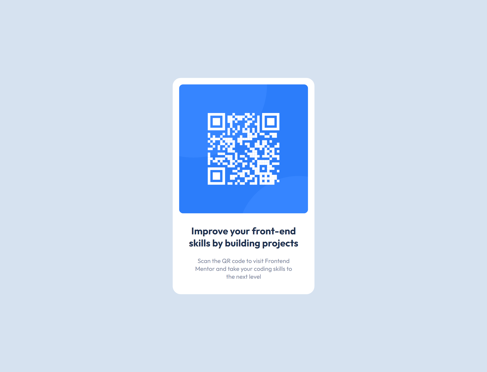

# Frontend Mentor - QR code component solution

This is a solution to the [QR code component challenge on Frontend Mentor](https://www.frontendmentor.io/challenges/qr-code-component-iux_sIO_H). Frontend Mentor challenges help you improve your coding skills by building realistic projects. 

## Table of contents

  - [Screenshot](#screenshot)
  - [Built with](#built-with)
  - [Links](#links)

### Screenshot

### Links

- Live Site URL: [Live Url](https://rohitk920.github.io/Frontend-Mentor-QR-code-component-solution/)

### Built with

- Semantic HTML5 markup
- CSS
